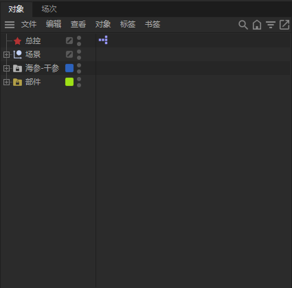
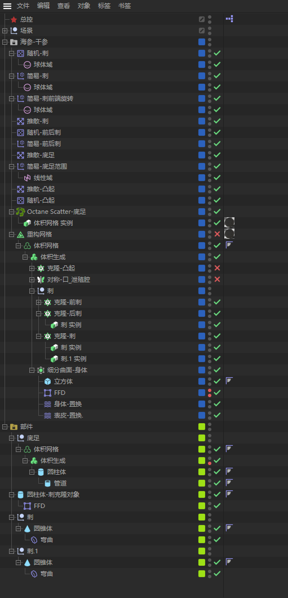
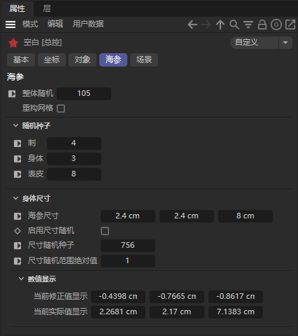

# C4D 程序化海参生成

## 简介

使用 XPresso 节点控制的 C4D 工程文件，用来随机生成海参模型。

## 原理

### 结构

工程文件内包含 4 个部分：`总控`、`场景`、`海参`和`部件`。

- `总控`主要承载 `XPresso` 标签和用户数据界面中的各项属性，是主要控制的模型的工具。
- `场景`内包含了摄像机、灯光等对象。
- `海参`内包含了主体模型和效果器等对象。
- `部件`内包含了底足、刺等身体部位的单个模型，作为`克隆`或 `Octane Scatter` 的子级对象。

*以上 4 部分的子级对象不再赘述。*

### XPresso

#### 整体随机

`整体随机`数值通过与其他数值想加同时影响着与它联系的随机种子。

#### 刺、身体、表皮

- `刺` 数值影响`克隆-刺`的效果器`随机-刺`的`种子`值。
	- 效果为：改变海参刺的位置、旋转和缩放。
- `身体` 数值影响`细分曲面-身体`的变形器`身体-置换`的噪波着色器`种子`值。
  - 效果为：改变海参身体形状。

- `表皮` 数值影响`细分曲面-身体`的变形器`表皮-置换`的噪波着色器`种子`值。
  - 效果为：改变海参表皮凸起。

以上 3 项均与`整体随机`数值相加。

#### 海参尺寸

`海参尺寸`将基础数值通过`矢量到实数`节点将矢量分离为 `X`、`Y`、`Z` 实数值后与分别与随机数相加，再通过`实数到矢量`合并为矢量输入到`立方体`的`尺寸`。

为保证比例基本统一，需将长边 `Z` 与短边 `X`、`Y` 分别进行除法运算，结果与最终相加前的随机数相乘。

#### 尺寸随机种子

`尺寸随机种子`数值输入到`随机`节点，与`尺寸随机范围绝对值`相乘后转化为实数输出

#### 尺寸随机范围绝对值

`尺寸随机范围绝对值`控制尺寸变化的范围。

#### 其他

- `启用尺寸随机`未实装，暂时无效果。
- `重构网格`控制同名生成器是否启用。
- 圆锥体改变长度保持底边不动

## 使用

通过调节总控面板的属性，达到生成符合需求的模型。

---

[![CC BY-SA 4.0][cc-by-sa-shield]][cc-by-sa]

本作品采用[知识共享署名-相同方式共享 4.0 国际许可协议](http://creativecommons.org/licenses/by-sa/4.0/)进行许可。

[![CC BY-SA 4.0][cc-by-sa-image]][cc-by-sa]

[cc-by-sa]: http://creativecommons.org/licenses/by-sa/4.0/
[cc-by-sa-image]: https://licensebuttons.net/l/by-sa/4.0/88x31.png
[cc-by-sa-shield]: https://img.shields.io/badge/License-CC%20BY--SA%204.0-lightgrey.svg
